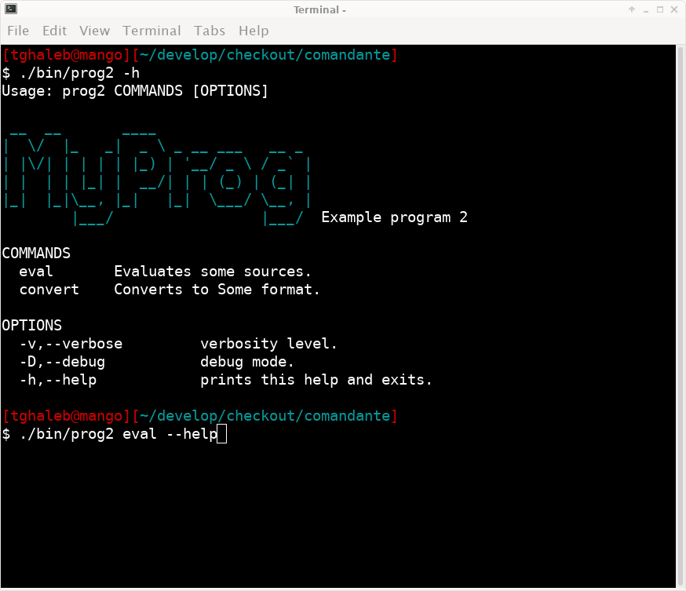

# Comandante

A simple CLI toolkit including an option parser and some helper
commands to make life easier.

## Documentation

<https://tghaleb.eu.org/comandante>

## Contributors

- [Tarek Ghaleb](https://github.com/tghaleb) - creator and maintainer
